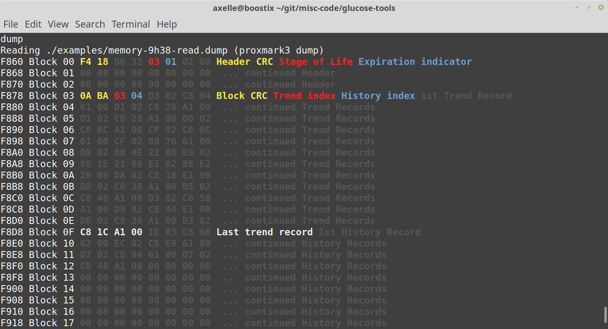

# Tools for NFC glucose sensor

- quick-reset.lua: Proxmark script to reset a sensor
- readdump.py: Understand sensor memory dumped by a Proxmark reader: `python3 readdump.py --proxmark ./examples/memory-9h38-read.dump`

**Asciinema video cast:**

**Screenshot**

{ width=50% }

