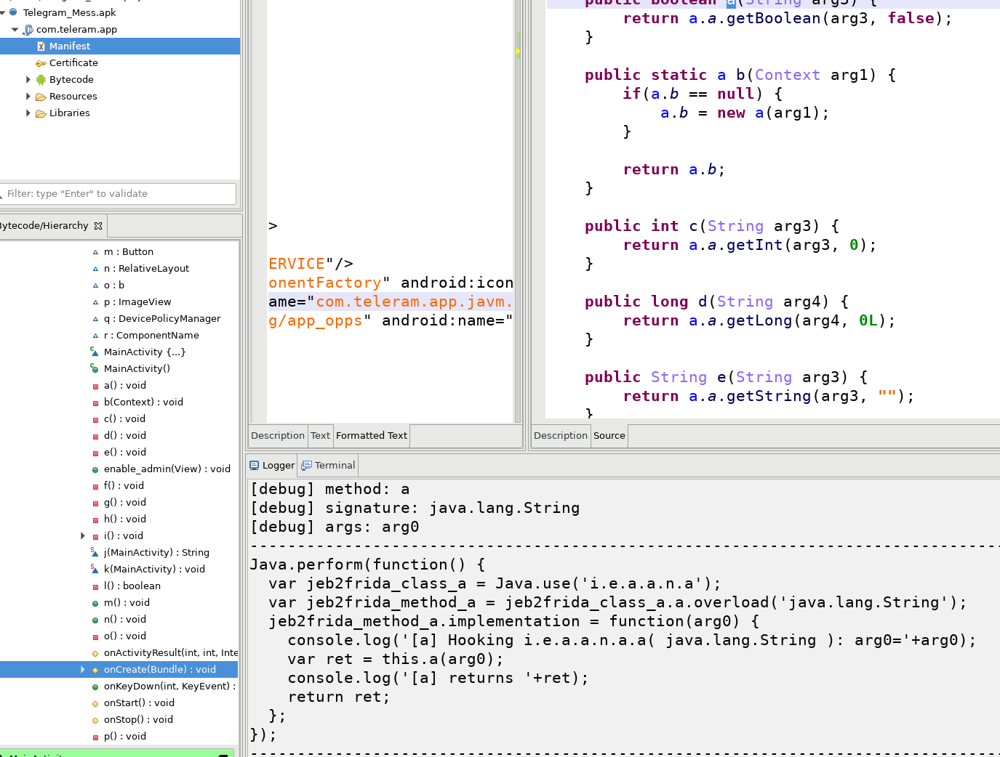
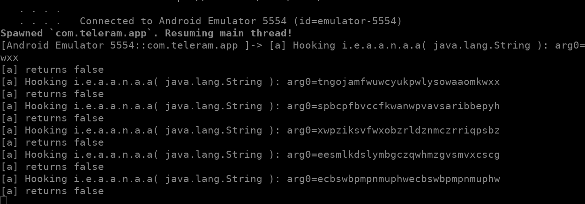

[Jeb2Frida](./Jeb2Frida.py) is a **JEB script** to automatically generate a Frida hook for a given method.

1. Select a method from the decompiled view. It doesn't actually matter what you select on the line, but it must be inside the line that declares the method.

For example below, you must select something within the first line.

```java
 public boolean a(String arg3) {
        return a.a.getBoolean(arg3, false);
    }
```

2. Run the script. The result appears in JEB's logger view.


3. Copy that in a JavaScript file, and run Frida as usual (e.g. `frida -U -f packagename -l scriptname --no-pause`)




